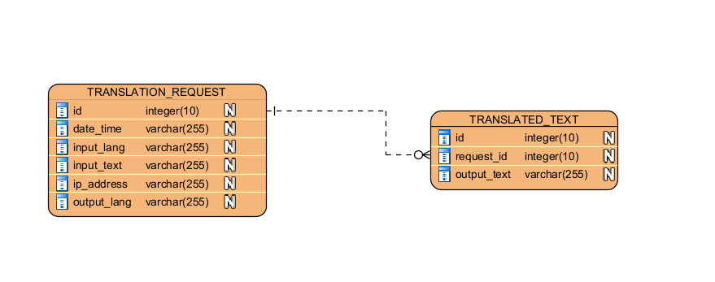

## Финтех tbank - вступительное испытание

В этом репозитории представлено моё решение
задачи по разработке веб-приложения на 
языке Java для перевода набора слов на другой язык 
с использованием стороннего сервиса перевода 
от Яндекс.

### Использованый стэк:
* Maven
* Spring
* MySQL Connector/J
* H2-Database
* Lombok

---
## Инструкция по запуску
1. Установите JDK 17 версии, а затем скачайте и откройте этот проект в IDE
2. Выполните команду ```mvn -N io.takari:maven:wrapper```
3. В корневой директории создайте файл ```.env``` с полем ```API_KEY=<ваш_api_key>```
   * О том, как получить API-Key, можете прочитать здесь: https://yandex.cloud/ru/docs/translate/
4. Последовательно выполните команды ```./mvnw clean package``` и ```./mvnw spring-boot:run```
   * Для запуска на Windows выполните ```mvnw.cmd clean package``` и ```mvnw.cmd spring-boot:run``` соответственно
5. Вы можете отправить запрос на перевод по адресу http://localhost:8080/swagger-ui.html
6. По адресу http://localhost:8080/h2-console/ доступна реляционная база данных с информацией о запросах на перевод и результатами работы соответствующего эндпоинта
   * Данные для аутентификации:
     * JDBC URL: jdbc:h2:mem:yandex_translation_db
     * User Name: user
     * Password: 1234 
7. В консоли h2 выполните запрос:
>```SELECT t.id AS id, t.ip_address, r.id as request_id, t.input_lang, t.input_text, t.output_lang, r.output_text, t.date_time,  FROM TRANSLATED_TEXT as r JOIN TRANSLATION_REQUEST as t ON r.request_id = t.id```

Этот запрос объединяет данные из таблиц ```TRANSLATED_TEXT``` и ```TRANSLATION_REQUEST```. 

---
> **N.b.** Обратите внимание, что каждому кортежу из таблицы ```TRANSLATION_REQUEST``` может соответствовать
один или несколько кортежей из таблицы ```TRANSLATED_TEXT```, так как некоторые слова после перевода состоят из большего количества букв,
чем до него. Это разделение необходимо из-за ограничения на размер поля ```output_text``` типа ```VARCHAR```, в котором хранится переведённый текст — 255 символов.


*Рис. 1 - ER-диаграмма*
---
